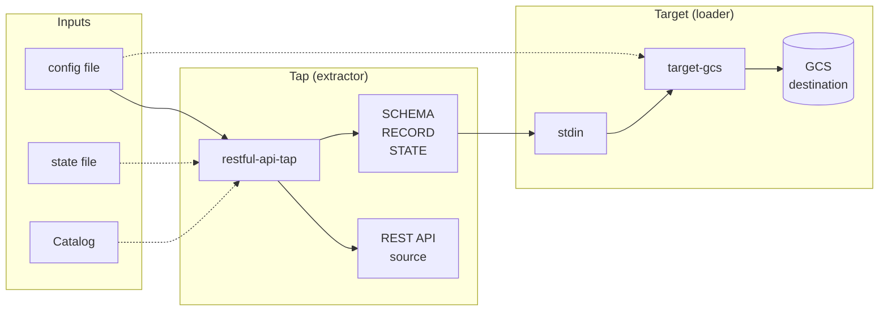

# AI Context — Repository Architecture

## Metadata

| Field | Value |
|-------|--------|
| Version | 1.2 |
| Last Updated | 2026-03-11 |
| Tags | architecture, repository, meltano, singer, taps, targets, monorepo |
| Cross-References | [AI_CONTEXT_QUICK_REFERENCE.md](AI_CONTEXT_QUICK_REFERENCE.md), [AI_CONTEXT_PATTERNS.md](AI_CONTEXT_PATTERNS.md), [AI_CONTEXT_restful-api-tap.md](AI_CONTEXT_restful-api-tap.md), [AI_CONTEXT_target-gcs.md](AI_CONTEXT_target-gcs.md), [GLOSSARY_MELTANO_SINGER.md](GLOSSARY_MELTANO_SINGER.md) (tap, target, streams, config/state/Catalog) |

---

## High-Level Overview

This repository is a **Meltano/Singer SDK monorepo** containing two standalone plugins: one Singer **tap** (extractor) and one Singer **target** (loader). Both are maintained by PawsForLife as forks of upstream projects. They are **custom** (not on the Meltano Hub or PyPI); add them in a Meltano project by editing `meltano.yml` with `pip_url` (Git URL + `#subdirectory=taps/restful-api-tap` or `#subdirectory=loaders/target-gcs`) and `namespace`; omit `variant` so Meltano uses the project definition.

- **restful-api-tap** — Extracts data from REST APIs. Streams and schemas are configured or auto-discovered; supports multiple auth types (Basic, API Key, Bearer, OAuth, AWS). Emits Singer-formatted JSONL to stdout.
- **target-gcs** — Loads Singer JSONL from stdin into Google Cloud Storage. Writes to a configurable bucket with configurable key naming.

The two components are independent packages. A typical pipeline runs the tap and pipes its stdout into the target (e.g. `meltano run restful-api-tap target-gcs`). There is no shared library; each plugin has its own `pyproject.toml`, dependencies, and test suite.

---

## Directory Structure

Annotated layout. Components are discovered from the repo; names are not hardcoded beyond the two plugin directories documented in the README.

```
meltano-plugins/
├── taps/
│   └── restful-api-tap/          # Tap (extractor) package
│       ├── restful_api_tap/      # Source package
│       │   ├── tap.py            # Tap class, CLI entry
│       │   ├── streams.py        # DynamicStream, stream logic
│       │   ├── auth.py           # Authenticators
│       │   ├── client.py         # RestApiStream base
│       │   ├── pagination.py     # Pagination helpers
│       │   └── utils.py          # flatten_json, etc.
│       ├── tests/                # Tap tests
│       ├── pyproject.toml        # Deps, script entry point
│       ├── install.sh            # Venv, deps, lint, test
│       ├── meltano.yml           # Plugin definition (Meltano)
│       └── config.sample.json    # Sample config
├── loaders/
│   └── target-gcs/               # Target (loader) package
│       ├── gcs_target/            # Source package
│       │   ├── target.py         # Target class, CLI entry
│       │   └── sinks.py         # GCSSink
│       ├── tests/                # Loader tests
│       ├── pyproject.toml        # Deps, script entry point
│       ├── install.sh            # Venv, deps, lint, test
│       ├── meltano.yml           # Plugin definition
│       └── sample.config.json   # Sample config
├── docs/                         # Project documentation
│   ├── AI_CONTEXT/               # AI context docs ({context_docs_dir})
│   │   ├── GLOSSARY_MELTANO_SINGER.md
│   │   ├── AI_CONTEXT_QUICK_REFERENCE.md
│   │   ├── AI_CONTEXT_REPOSITORY.md  # This file
│   │   ├── AI_CONTEXT_PATTERNS.md
│   │   ├── AI_CONTEXT_restful-api-tap.md
│   │   └── AI_CONTEXT_target-gcs.md
│   ├── README.md                 # Docs index
│   ├── spec/                     # Singer spec
│   ├── taps/                     # Tap-building guides
│   ├── targets/                  # Target-building guides
│   └── monorepo/                 # Monorepo usage
├── _features/                    # Feature request artifacts ({features_dir})
├── _bugs/                        # Bug investigation artifacts ({bugs_dir}); created when needed
├── _archive/                     # Completed feature/bug artifacts ({archive_dir})
├── .cursor/                      # Cursor rules, workflows, agents, skills
│   ├── CONVENTIONS.md            # Path placeholders, Git
│   ├── rules/
│   ├── workflows/
│   ├── skills/
│   └── commands/
├── scripts/                      # Repo-level scripts (e.g. list_packages)
├── .github/workflows/            # CI (e.g. plugin-matrix)
├── README.md                     # Project summary, install, layout
└── CHANGELOG.md
```

Placeholders `{context_docs_dir}`, `{features_dir}`, `{bugs_dir}`, `{archive_dir}` are defined in `.cursor/CONVENTIONS.md` (defaults: `docs/AI_CONTEXT`, `_features`, `_bugs`, `_archive`).

---

## Component Responsibilities

### restful-api-tap (taps/restful-api-tap)

| Responsibility | Description |
|----------------|-------------|
| **Role** | Singer tap: reads from REST APIs, emits Singer messages (SCHEMA, RECORD, STATE) to stdout. |
| **Entry** | `restful-api-tap` CLI → `restful_api_tap.tap:RestfulApiTap.cli`. |
| **Core modules** | `tap.py` (Tap class, config schema, stream discovery/sync), `streams.py` (DynamicStream, pagination, record extraction), `auth.py` (get_authenticator, OAuth/AWS/Basic/API Key/Bearer), `client.py` (RestApiStream base), `pagination.py`, `utils.py`. |
| **Config** | Top-level and stream-level: api_url, path, params, headers, records_path, primary_keys, replication_key, auth, pagination style, etc. |
| **Output** | Singer JSONL (SCHEMA, RECORD, STATE) on stdout. |

Details: [AI_CONTEXT_restful-api-tap.md](AI_CONTEXT_restful-api-tap.md).

### target-gcs (loaders/target-gcs)

| Responsibility | Description |
|----------------|-------------|
| **Role** | Singer target: reads Singer JSONL from stdin, writes record batches to GCS. |
| **Entry** | `target-gcs` CLI → `gcs_target.target:GCSTarget.cli`. |
| **Core modules** | `target.py` (GCSTarget, config_jsonschema, default_sink_class), `sinks.py` (GCSSink, key naming, batch writes via smart_open / GCS client). |
| **Config** | bucket_name (required), key_prefix, key_naming_convention, date_format. |
| **Input** | Singer JSONL (SCHEMA, RECORD, STATE) on stdin. |

Details: [AI_CONTEXT_target-gcs.md](AI_CONTEXT_target-gcs.md).

---

## Data Flow

End-to-end flow when running a tap → target pipeline (e.g. Meltano or shell pipe). Terms (tap, target, source, destination, streams, config file, state file, Catalog) follow [GLOSSARY_MELTANO_SINGER.md](GLOSSARY_MELTANO_SINGER.md).



- **Config file** — JSON (or Meltano-injected env) supplying tap parameters (api_url, auth, stream definitions) and target parameters (bucket_name, key_prefix). Required for the tap; optional for the target.
- **State file** — Optional JSON passed to the tap for incremental sync; holds bookmarks per stream. The tap may emit STATE messages to update it.
- **Catalog** — Describes which **streams** to extract and replication metadata. Produced by tap `--discover` or supplied by Meltano; in sync the tap receives the catalog (or equivalent selection).
- **Tap** — Reads from **source** (REST API). Emits SCHEMA (per stream), RECORD, and STATE to stdout. **Streams** are named sets of data (e.g. one per endpoint).
- **Target** — Reads Singer JSONL from stdin, batches records per stream, writes to **destination** (GCS bucket) via GCSSink.

No shared process state; communication is Singer JSONL on stdout → stdin. State messages can be persisted by Meltano or the target for the next run.

---

## Service/Module Boundaries & Dependencies

| Boundary | Description |
|----------|-------------|
| **Tap ↔ Target** | No shared code. Communication is Singer JSONL on stdout/stdin. |
| **Tap ↔ Meltano** | Meltano invokes the tap CLI, passes config (and optional state file and catalog); tap is a separate process. |
| **Target ↔ Meltano** | Meltano invokes the target CLI, pipes tap stdout into target stdin; target is a separate process. |

### Key external dependencies (per plugin)

- **restful-api-tap**: `singer-sdk`, `requests`, `genson`, `atomicwrites`, `requests-aws4auth`, `boto3`. Python ≥3.12.
- **target-gcs**: `singer-sdk`, `google-cloud-storage`, `google-api-python-client`, `smart-open[gcs]`, `orjson`, `requests`. Python ≥3.8,<4.0.

Each plugin is installable on its own via `pip` from its subdirectory (`pip install -e .` or Meltano `pip_url` with `#subdirectory=taps/restful-api-tap` or `#subdirectory=loaders/target-gcs`; see README for `meltano.yml` examples).

---

## Entry Points & Extension Hooks

| Plugin | CLI command | Entry point (pyproject.toml) |
|--------|-------------|------------------------------|
| restful-api-tap | `restful-api-tap` | `restful_api_tap.tap:RestfulApiTap.cli` |
| target-gcs | `target-gcs` | `gcs_target.target:GCSTarget.cli` |

- **Running** — After install (Meltano or `uv sync` in plugin dir), run the CLI with `--config <path>` (tap/target read config from config file or Meltano-injected env). Target reads Singer messages from stdin.
- **Extension points**  
  - **Tap**: Subclass `RestfulApiTap`; add or override streams (e.g. subclass or replace `DynamicStream`); add auth via `get_authenticator` / custom `APIAuthenticatorBase`; custom pagination in `restful_api_tap.pagination` and stream classes.  
  - **Target**: Subclass `GCSTarget` and/or `GCSSink`; override `default_sink_class` or sink behavior (e.g. key naming, batch size, format).

Discovery of components: the repo layout is the source of truth; the two main components are the directories under `taps/` and `loaders/` that contain a `pyproject.toml` and a Singer tap or target implementation.
